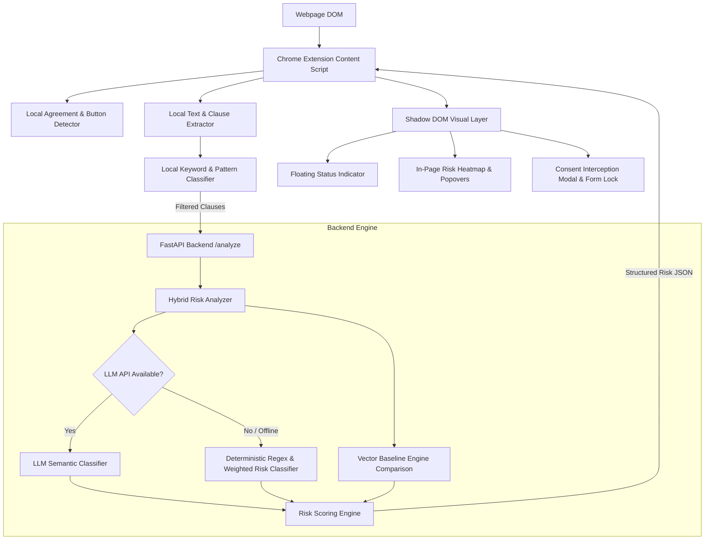

# WebSense — Autonomous Legal Risk Interceptor

[](https://github.com/vishaal-08/WebSense/actions)


> *"Real-time protection before you click Accept."*

WebSense is an autonomous Chrome Extension and backend semantic analysis engine that protects users from hidden legal risks in Terms of Service, privacy policies, NDAs, SaaS agreements, and consent forms **directly inside the browser at the exact moment of consent**.

---

## 1. Problem
Digital contracts have become unreadable traps. The average Terms of Service agreement takes 35+ minutes to read. Over 97% of consumers click "I Agree" blindly, unknowingly signing away:
- Intellectual property & invention rights
- Personal data monetization permissions
- Rights to court trials or class action lawsuits via forced binding arbitration
- Perpetual, irrevocable content licenses
- Unilateral non-refundable recurring billing

---

## 2. Solution
A user should **NEVER** have to copy-paste a 50-page PDF contract into ChatGPT to understand if they are about to sign a dangerous agreement.

WebSense operates natively inside Chrome:
1. **Automatically detects** agreement interfaces and consent buttons (`"Accept"`, `"Sign"`, `"Submit"`).
2. **Extracts** agreement clauses directly from the live DOM.
3. **Performs fast local risk detection** & hybrid semantic backend analysis.
4. **Calculates a Legal Risk Score (0–100)** and categorizes 20 material risk types.
5. **Highlights risky clauses** with in-page heatmaps and plain-English popovers.
6. **Pre-emptively intercepts submission** when serious risks are present, requiring explicit user review before continuing.

---

## 3. Why Existing AI Chatbots Are Insufficient
Traditional LLM wrappers suffer from critical flaws for legal protection:
- **High Friction**: Requires manual copy-pasting into chat windows.
- **Out of Context**: LLMs lack real-time DOM access to intercept forms or check consent buttons.
- **Latency & Reliability**: LLM API outages or missing keys break traditional wrappers.
- **Privacy Exposure**: Dumb extensions upload full web pages unnecessarily to cloud APIs.

WebSense solves this by implementing **ambient browser-native protection** with local-first filtering and a fail-safe deterministic classifier.

---

## 4. System Architecture



---

## 5. Technical Implementation
- **Frontend / Extension**: Chrome Extension Manifest V3, Shadow DOM style isolation, MutationObserver, Capture-phase event interception.
- **Backend API**: Python, FastAPI, Uvicorn, Pydantic v2.
- **Risk Classifier**: Hybrid engine combining LLM structured outputs with a 20-category deterministic legal pattern classifier.
- **Vector Baseline Comparison**: Lightweight N-gram TF-IDF cosine similarity engine comparing candidate clauses against standard legal baselines (NDA, SaaS Terms, Privacy Policy, Freelancer Agreement, Employment, SAFE).

---

## 6. Risk Scoring Engine Math
The Legal Risk Score (0–100) is calculated via a documented deterministic formula:

$$\text{Document Score} = \text{clamp}\left(\text{Top Clause Score} + \sum_{i=1}^{n} (\text{Clause}_i \times 0.45 \times 0.55^{0.7i}) + \text{Breadth Bonus}, 0, 100\right)$$

- **0 – 29**: `LOW RISK` (Calm Green)
- **30 – 59**: `MODERATE RISK` (Warning Amber)
- **60 – 79**: `HIGH RISK` (Orange/Red)
- **80 – 100**: `CRITICAL RISK` (Urgent Red)

---

## 7. Privacy Architecture
WebSense enforces **local-first DOM extraction**. It filters DOM elements inside the content script using keyword matchers before transmitting candidate clauses to the backend. Raw browsing data and un-related webpage HTML are **never** logged or transmitted.

---

## 8. Installation & Setup Instructions

### Step 1: Start FastAPI Backend
```bash
cd backend
python -m pip install -r requirements.txt
python -m uvicorn app.main:app --port 8000 --reload
```

### Step 2: Load Chrome Extension
1. Open Google Chrome and navigate to `chrome://extensions`.
2. Enable **Developer mode** (top-right toggle).
3. Click **Load unpacked**.
4. Select the `extension/` directory from this repository.

### Step 3: Launch Demo Website
```bash
python -m http.server 8080 --directory demo-site
```
Visit `http://localhost:8080` in your browser.

---

## 9. API Documentation

### Endpoints
- `GET /health`: Returns system status and LLM availability.
- `POST /analyze`: Main endpoint for analyzing agreement clauses and computing risk scores.
- `POST /analyze/batch`: Batch process multiple documents concurrently.
- `POST /baseline/compare`: Compare a clause against baseline legal standards to calculate deviation scores.
- `GET /risk-categories`: List all 20 monitored legal risk categories.

---

## 10. Automated Testing
Run the Pytest suite verifying classifier accuracy, scoring formula clamping, and API endpoints:
```bash
$env:PYTHONPATH="backend"
python -m pytest backend/tests
```

---

## 11. Known Limitations
- Heavy iframe-isolated terms (cross-origin cross-domain sandboxed iframes) require activeTab permission authorization.
- WebSense provides automated risk signals, not formal legal advice.

---

## 12. Legal Disclaimer
*WebSense provides automated risk signals and plain-English clause analysis. WebSense is an automated software tool and does not provide formal legal advice or representation.*

---

## ⚖️ JUDGE MODE Checklist

| Judging Criteria | Status | Details |
| :--- | :---: | :--- |
| **Technical Implementation** | ✅ | Full Manifest V3 extension, FastAPI backend, Shadow DOM UI, Pytest suite passing. |
| **Real-World Impact** | ✅ | Solves blind consent agreement traps natively inside browser. |
| **Deployment & Scalability** | ✅ | Docker containerized, stateless backend architecture, offline local fallback. |
| **Innovation & Originality** | ✅ | Ambient pre-emptive submission interception & form locking. |
| **UI/UX & Product Experience** | ✅ | Scoped Shadow DOM, floating status indicator, popover heatmaps. |
| **Demo & Presentation** | ✅ | Dual interactive demo (CloudFlow High Risk + Simple Notes Safe). |
