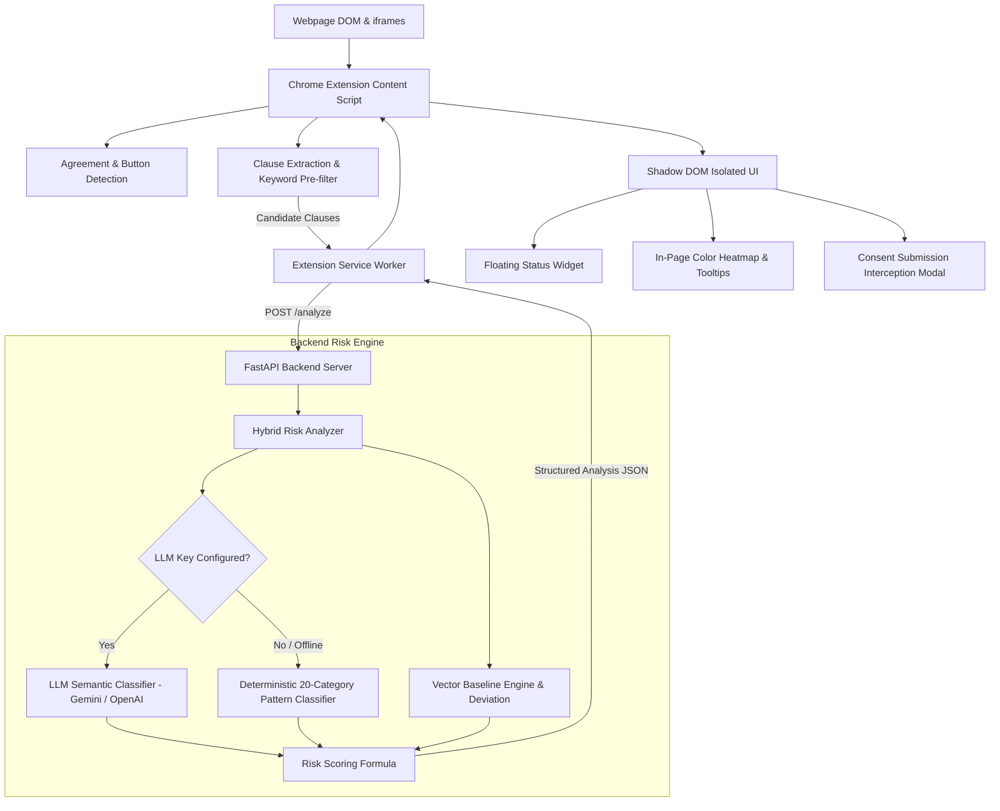

# WebSense

[](https://github.com/vishaal-08/WebSense/actions)


> Autonomous browser extension that detects Terms & Conditions and identifies potential legal risks before users accept.

---

## Problem

Digital contracts have become unreadable traps. Consumer research indicates that **91% of consumers accept legal terms without reading them**, unknowingly consenting to predatory clauses buried in dense legalese:
- Permanent loss or broad assignment of intellectual property and inventions.
- Irrevocable, perpetual, worldwide licenses to user-generated content.
- Commercialization, sale, and monetization of personal user data.
- Stripping of constitutional rights to court or jury trials through forced binding arbitration and class action waivers.
- Unilateral disclaimers of liability and automatic recurring renewals with burdensome cancellation barriers.

Standard conversational AI chatbots fail to protect users in practice: they require manually copy-pasting multi-page agreements into an external chat window, introducing severe user friction and providing zero ambient protection at the exact moment of consent.

---

## Solution

WebSense provides **browser-native, ambient legal risk protection** directly within the webpage:
1. **Passive DOM Scanning**: Automatically detects agreement text containers, terms links, and submission buttons (`"Accept"`, `"Sign"`, `"Submit"`) without requiring user prompting.
2. **In-Page Visual Heatmap**: Injects dynamic color-coded highlights (Red = High/Critical Liability, Amber = Ambiguous/Moderate Risk) directly over risky clauses on the page.
3. **Plain-English Tooltips**: Displays contextual hover cards explaining what each clause means and why it matters in accessible language.
4. **Pre-Emptive Consent Interception**: When serious legal hazards are detected, WebSense intercepts button clicks, locks submission, and presents an explicit review modal before the user can proceed.

---

## Key Differentiator

> **WebSense works natively inside the browser and can intercept risky consent BEFORE the user accepts.**

Traditional AI legal tools act as passive chatbots outside the browsing workflow. WebSense operates directly at the **critical millisecond of consent**: using capture-phase event listeners, it temporarily halts form submission when predatory terms are detected, requiring the user to explicitly acknowledge the risks before continuing.

---

## Core Workflow

```
1. User Opens Webpage ➔ 2. Passive Detection ➔ 3. Clause Extraction ➔ 4. Hybrid Analysis & Scoring ➔ 5. In-Page Heatmap & Interception
```

1. **User Opens a Webpage**: The user visits a signup page, checkout flow, or service agreement.
2. **Passive Detection**: The content script continuously monitors the DOM for agreement keywords and consent buttons.
3. **Clause Extraction & Local Pre-Filter**: Relevant clauses are extracted and pre-filtered locally for privacy and sub-millisecond response.
4. **Hybrid Analysis & Scoring**: The backend classifies clauses against 20 legal risk categories, computes baseline deviation, and calculates a 0–100 risk score.
5. **In-Page Heatmap & Interception**: Clauses are highlighted in-place with hoverable tooltips. If the agreement is high-risk, clicking "Accept" triggers a modal guardrail.

---

## Architecture

The diagram below reflects the edge-to-cloud pipeline implemented in the codebase:



---

## AI & Hybrid Analysis

WebSense employs a resilient, hybrid architecture combining deterministic rule-based analysis with optional deep semantic classification:

1. **Deterministic Legal Pattern Classifier**:
   - Evaluates clauses across 20 material risk categories using battle-tested regex patterns and contextual weights.
   - Operates 100% offline with zero external API dependencies, guaranteeing that the extension never fails due to network drops, rate limits, or expired keys.

2. **Vector Baseline Deviation Engine**:
   - Compares candidate clauses against standardized, fair legal baselines (NDAs, YC SAFEs, SaaS Terms, Privacy Policies).
   - Powered by a ChromaDB vector collection with an automatic in-memory n-gram cosine similarity fallback, calculating mathematical deviation scores (0–100%) from customary legal standards.

3. **Optional LLM Semantic Classifier**:
   - When configured with a `GEMINI_API_KEY` (Google Gemini 1.5 Flash) or `OPENAI_API_KEY` (GPT-4o-mini), WebSense can perform structured semantic analysis for deep nuance.
   - If the LLM call times out or encounters errors, the engine falls back to the deterministic classifier without interrupting the user.

---

## 20 Monitored Legal Risk Categories

WebSense continuously scans for 20 distinct categories of legal liability:

| Category | Default Severity | Description |
| :--- | :---: | :--- |
| `IP_ASSIGNMENT` | **CRITICAL** | Transfers or assigns user intellectual property and inventions to the provider. |
| `DATA_SALE` | **CRITICAL** | Permits selling, renting, or commercializing personal user data. |
| `PERPETUAL_RIGHTS` | **HIGH** | Grants rights that survive indefinitely and cannot be revoked upon account deletion. |
| `BROAD_LICENSE` | **HIGH** | Grants expansive rights to use, modify, distribute, and commercialize uploads. |
| `AI_TRAINING` | **HIGH** | Uses user proprietary content, code, or data to train generative AI/ML models. |
| `MANDATORY_ARBITRATION` | **HIGH** | Forces dispute resolution via private arbitration rather than public court. |
| `CLASS_ACTION_WAIVER` | **HIGH** | Strips rights to participate in class action lawsuits. |
| `INDEMNIFICATION` | **HIGH** | Requires the user to pay provider legal fees and damages for third-party claims. |
| `UNILATERAL_LIABILITY` | **HIGH** | Caps provider liability to $0/minimal sums while reserving unilateral term changes. |
| `SURVEILLANCE` | **HIGH** | Permits screen, keystroke, clipboard, or local device monitoring. |
| `RESTRICTIVE_TERMS` | **HIGH** | Imposes non-compete covenants or client solicitation restrictions. |
| `CONTENT_OWNERSHIP` | **HIGH** | Claims that user-generated uploads become provider property. |
| `AUTO_RENEWAL` | **MEDIUM** | Automatically renews subscriptions and charges payment methods recurringly. |
| `DIFFICULT_CANCELLATION` | **MEDIUM** | Imposes strict cancellation windows, certified mail requirements, or no-refund policies. |
| `DATA_HARVESTING` | **MEDIUM** | Collects expansive telemetry, location, biometric, or cross-site tracking data. |
| `DATA_SHARING` | **MEDIUM** | Shares user data with marketing partners or advertisers. |
| `THIRD_PARTY_SHARING` | **MEDIUM** | Distributes data to unspecified third-party business partners. |
| `TERMINATION_RIGHTS` | **MEDIUM** | Reserves rights to terminate accounts instantly without cause or notice. |
| `OTHER_MATERIAL_RISK` | **MEDIUM** | Imposes non-standard financial forfeiture, penalties, or credit seizures. |
| `GOVERNING_LAW` | **LOW** | Designates distant foreign courts or asymmetric attorney fee shifting. |

---

## Risk Scoring Engine

The aggregate document score ($0–100$) is computed mathematically using a transparent, deterministic model:

$$\text{Document Score} = \text{clamp}\left(\text{Top Clause Score} + \sum_{i=1}^{n} (\text{Clause}_i \times 0.45 \times 0.55^{0.7i}) + \text{Breadth Bonus}, 0, 100\right)$$

- **Anchor Score**: The highest-risk clause sets the foundational baseline score.
- **Diminishing Marginal Returns**: Subsequent clauses add weighted impact with exponential decay ($0.55^{0.7i}$), preventing score inflation while penalizing stacked risks.
- **Category Diversity Bonus**: Agreements spanning multiple distinct risk categories receive up to 15 additional points.

### Risk Level Tiers
- **0 – 29**: `LOW RISK` — Standard, balanced customary terms.
- **30 – 59**: `MODERATE RISK` — Ambiguous terms or moderate commercial burdens.
- **60 – 79**: `HIGH RISK` — Significant unilateral burdens; triggers warning highlights.
- **80 – 100**: `CRITICAL RISK` — Severe predatory terms; triggers form interception lock.

---

## Privacy & Security

- **Local-First Pre-Filtering**: The extension inspects text locally; only candidate agreement sentences matching legal triggers are sent to the backend. Full page HTML and unrelated browsing data are never transmitted.
- **Stateless Analysis**: The backend performs ephemeral analysis in-memory and does not store browsing histories, user profiles, or IP logs.
- **Shadow DOM Isolation**: All UI elements (status widget, hover popovers, consent modal) are mounted within an isolated Shadow Root (`hostEl.attachShadow({ mode: "open" })`), protecting extension state from page scripts and preventing CSS leaks.
- **Least-Privilege Manifest**: The extension requests only `storage` and `activeTab` permissions, eliminating unnecessary privileges.

---

## Tech Stack

- **Browser Extension**: Chrome Extension Manifest V3, JavaScript (ES6+), Shadow DOM API, TreeWalker DOM API.
- **Backend API**: Python 3.11+, FastAPI, Uvicorn, Pydantic v2.
- **Vector Engine**: ChromaDB vector collection with built-in n-gram TF cosine fallback.
- **Optional LLM Providers**: Google Gemini 1.5 Flash (via REST), OpenAI GPT-4o-mini (via Chat Completions).
- **Containerization & CI**: Docker, Docker Compose, GitHub Actions.
- **Automated Testing**: Pytest, AnyIO, FastAPI TestClient, HTTPX.

---

## Project Structure

```
WebSense/
├── .github/
│   ├── workflows/
│   │   └── ci.yml               # Automated CI test pipeline
│   ├── ISSUE_TEMPLATE/
│   │   ├── bug_report.md        # Issue template for bugs
│   │   └── feature_request.md   # Issue template for feature proposals
│   └── pull_request_template.md # Pull request checklist template
├── backend/
│   ├── app/
│   │   ├── analyzers/
│   │   │   ├── hybrid_analyzer.py   # Hybrid LLM + local coordinator
│   │   │   ├── llm_analyzer.py      # Optional Gemini/OpenAI structured analyzer
│   │   │   └── local_analyzer.py    # 20-category deterministic legal classifier
│   │   ├── api/
│   │   │   └── routes.py            # FastAPI REST endpoints
│   │   ├── baselines/
│   │   │   └── legal_baselines.py   # Standard fair legal templates (NDA, TOS, SaaS)
│   │   ├── models/
│   │   │   └── schemas.py           # Pydantic v2 request/response schemas
│   │   ├── scoring/
│   │   │   └── risk_engine.py       # Mathematical 0-100 scoring engine
│   │   ├── vector/
│   │   │   └── lightweight_vector.py# Vector baseline similarity engine
│   │   ├── __init__.py
│   │   └── main.py                  # FastAPI application entrypoint
│   ├── tests/
│   │   └── test_risk_engine.py      # Automated test suite (16 test cases)
│   └── requirements.txt             # Python backend dependencies
├── demo-site/
│   ├── app.js                       # Interactive demo behaviors
│   ├── index.html                   # Demo landing hub
│   ├── risky.html                   # High-risk terms sample page (CloudFlow AI)
│   ├── safe.html                    # Low-risk terms sample page (Simple Notes)
│   └── styles.css                   # Demo site styling
├── docs/
│   ├── architecture.md              # Architectural specifications
│   └── demo-script.md               # 3-minute hackathon demonstration script
├── extension/
│   ├── background/
│   │   └── service-worker.js        # Background service worker & badge manager
│   ├── content/
│   │   ├── ui/
│   │   │   ├── overlay.js           # Shadow DOM status pill, tooltips, & modal
│   │   │   └── styles.css           # Scoped Shadow DOM styles
│   │   ├── content.js               # Content script orchestrator
│   │   ├── detector.js              # DOM agreement & button detector
│   │   ├── extractor.js             # Sentence tokenizer & keyword pre-filter
│   │   ├── highlighter.js           # DOM TreeWalker text highlighter
│   │   └── interceptor.js           # Capture-phase click & submit interceptor
│   ├── popup/
│   │   ├── popup.css                # Extension popup styling
│   │   ├── popup.html               # Extension popup interface
│   │   └── popup.js                 # Popup data binding & re-scan trigger
│   └── manifest.json                # Manifest V3 configuration
├── .env.example                     # Environment configuration template
├── .gitignore                       # Git ignore specifications
├── CONTRIBUTING.md                  # Development and contribution guide
├── docker-compose.yml               # Multi-service container configuration
├── Dockerfile                       # Backend container definition
├── LICENSE                          # MIT License
└── README.md                        # Project documentation
```

---

## Installation & Running Locally

### Step 1: Clone Repository
```bash
git clone https://github.com/vishaal-08/WebSense.git
cd WebSense
```

### Step 2: Backend Setup
```bash
python -m venv venv

# Windows (PowerShell):
.\venv\Scripts\activate

# macOS / Linux:
source venv/bin/activate

pip install -r backend/requirements.txt
```

Start the FastAPI development server:
```bash
python -m uvicorn app.main:app --app-dir backend --host 0.0.0.0 --port 8000 --reload
```
*The backend is now running at `http://localhost:8000` (Development only).*

### Step 3: Chrome Extension Setup
1. Open Google Chrome and navigate to `chrome://extensions`.
2. Enable **Developer mode** (top-right toggle).
3. Click **Load unpacked**.
4. Select the `extension/` directory from this repository.

### Step 4: Launch Demo Site
```bash
python -m http.server 8080 --directory demo-site
```
Visit `http://localhost:8080` in Chrome to test the high-risk and safe agreement flows.

---

## Testing

WebSense includes an automated test suite verifying classification accuracy across all 20 categories, false-positive resistance, scoring math, API routing, and LLM fallback logic.

Run the test suite from the repository root:

```bash
# Windows PowerShell:
$env:PYTHONPATH="backend"; python -m pytest backend/tests -v

# macOS / Linux:
PYTHONPATH=backend python -m pytest backend/tests -v
```

### Verified Test Results
```
backend/tests/test_risk_engine.py::test_health_endpoint PASSED           [  6%]
backend/tests/test_risk_engine.py::test_risk_categories_endpoint PASSED  [ 12%]
backend/tests/test_risk_engine.py::test_local_classifier_detection PASSED [ 18%]
backend/tests/test_risk_engine.py::test_scoring_clamping_and_levels PASSED [ 25%]
backend/tests/test_risk_engine.py::test_analyze_api_endpoint PASSED      [ 31%]
backend/tests/test_risk_engine.py::test_baseline_compare_endpoint PASSED [ 37%]
backend/tests/test_risk_engine.py::test_all_20_categories_detection PASSED [ 43%]
backend/tests/test_risk_engine.py::test_false_positive_and_clean_clauses PASSED [ 50%]
backend/tests/test_risk_engine.py::test_batch_analysis_api_endpoint PASSED [ 56%]
backend/tests/test_risk_engine.py::test_empty_and_whitespace_requests PASSED [ 62%]
backend/tests/test_risk_engine.py::test_vector_engine_deviation_logic PASSED [ 68%]
backend/tests/test_risk_engine.py::test_llm_analyzer_missing_key_graceful[asyncio] PASSED [ 75%]
backend/tests/test_risk_engine.py::test_llm_analyzer_openai_mocked_success[asyncio] PASSED [ 81%]
backend/tests/test_risk_engine.py::test_llm_analyzer_openai_markdown_code_fences[asyncio] PASSED [ 87%]
backend/tests/test_risk_engine.py::test_llm_analyzer_gemini_mocked_success[asyncio] PASSED [ 93%]
backend/tests/test_risk_engine.py::test_llm_analyzer_timeout_and_errors_graceful[asyncio] PASSED [100%]

======================== 16 passed, 1 warning in 3.47s ========================
```

---

## API Endpoints

| Method | Endpoint | Description |
| :--- | :--- | :--- |
| `GET` | `/health` | System health check and analyzer status. |
| `GET` | `/risk-categories` | Listing of all 20 monitored legal risk categories. |
| `POST` | `/analyze` | Primary endpoint for analyzing contract clauses and computing risk scores. |
| `POST` | `/analyze/batch` | Batch endpoint for processing multiple document payloads concurrently. |
| `POST` | `/baseline/compare` | Evaluates a single clause against baseline standards to compute deviation. |

Interactive OpenAPI documentation is available locally at `http://localhost:8000/docs`.

---

## Deployment & Production Notes

- **Development Configuration**: The backend runs by default on `http://localhost:8000` with `ALLOWED_ORIGINS=*` to permit local Chrome extension communication.
- **Production Guidelines**:
  - Set `ENVIRONMENT=production` and restrict `ALLOWED_ORIGINS` in `.env` to authorized domain names or extension IDs.
  - Production Chrome extensions require secure `https://` communication endpoints.
  - Run containerized via the included [`Dockerfile`](Dockerfile) or `docker-compose.yml`.
  - The stateless backend architecture scales horizontally behind standard reverse proxies (NGINX/Traefik).

---

## Limitations

- **Informational Tool, Not Legal Advice**: WebSense provides automated risk signals based on pattern matching and semantic classification. It is not an attorney and does not substitute for qualified legal counsel.
- **Cross-Domain Sandboxed Iframes**: While `all_frames: true` enables detection within embedded frames, strictly isolated third-party cross-domain frames that disallow script injection cannot be inspected without explicit elevated browser permissions.
- **Language Scope**: Current baseline models and pattern classifiers are calibrated primarily for English-language commercial agreements.

---

## Future Scope

- **Negotiation Counter-Clause Generator**: Generate customized opt-out language (e.g. standard arbitration opt-out notices) that users can copy or email to service providers.
- **Dark Pattern Detection**: Expand DOM analysis to detect deceptive design patterns in consent dialogs (e.g. hidden decline buttons, pre-checked boxes).
- **Exportable Audit Summaries**: Enable one-click export of analyzed agreements into concise Markdown or PDF audit reports for offline records.

---

## Team / Contributors

**Tech Titans** — Built for Technovit '26 (Hackverse: Into the Web)
- vishaal-08 (Lead Developer)
- Tech Titans Team Members

---

## License

This project is licensed under the MIT License — see the [LICENSE](LICENSE) file for details.
