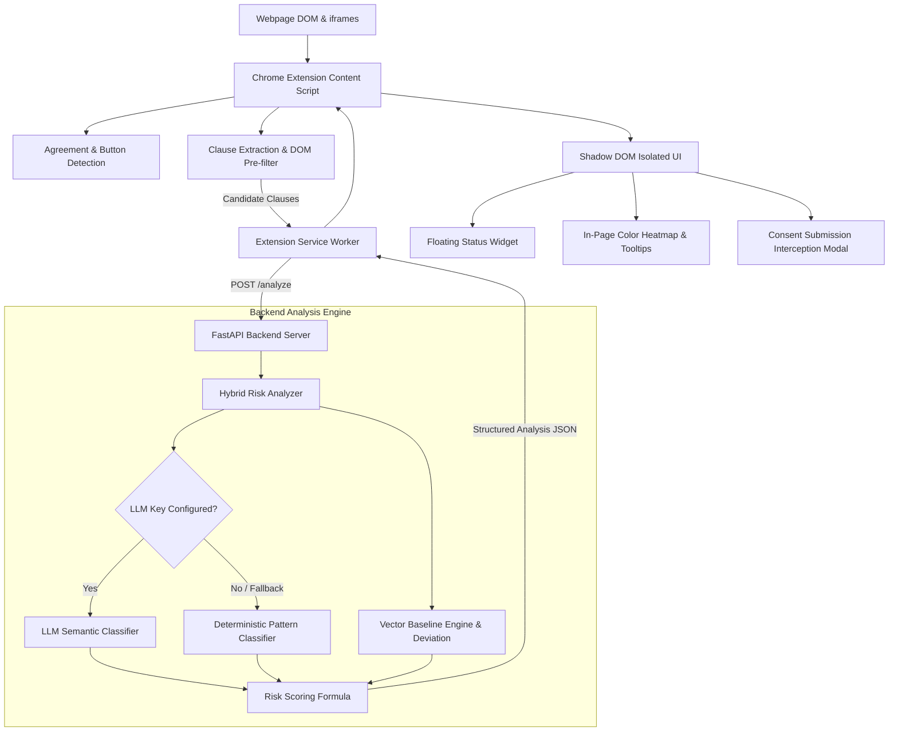

# WebSense

[](https://github.com/vishaal-08/WebSense/actions)


> Autonomous browser extension that detects Terms & Conditions and helps users identify potential legal risks before accepting.

---

## Problem

Digital agreements—such as Terms of Service, Privacy Policies, NDAs, and SaaS contracts—are engineered to be long, dense, and full of legalese. Most users encounter agreements when signing up for services, creating accounts, or installing software. 

Because reading entire agreements manually is tedious and time-consuming, users routinely click "I Agree" or "Accept" without reviewing the terms. This habit leads to accepting clauses that may:
- Assign intellectual property rights away to the platform.
- Grant perpetual, irrevocable licenses over user-created content.
- Permit third-party data monetization or broad telemetry collection.
- Waive rights to jury trials or class action participation through forced binding arbitration.
- Impose unilateral liability disclaimers and automatic recurring renewals.

Generic conversational chatbots do not solve this problem effectively: they require users to manually copy and paste multi-page agreements into an external prompt, removing protection from the actual browser workflow at the point of consent.

---

## Solution

WebSense provides **in-browser, ambient legal risk detection** that operates directly on the active webpage:
1. **Passive Detection**: Identifies agreement text blocks and consent submission buttons (`"Accept"`, `"Sign"`, `"Submit"`) without requiring prompt copying.
2. **Clause Extraction**: Parses sentences from the live Document Object Model (DOM) and applies local keyword pre-filtering.
3. **Hybrid Risk Analysis**: Evaluates clauses using deterministic pattern classifiers (and optional LLM semantic analysis if an API key is configured).
4. **Visual Risk Heatmap**: Highlights concerning clauses directly on the webpage (Red for high liability, Amber for ambiguous or moderate risk).
5. **Plain-English Explanations**: Provides contextual tooltips explaining what each detected clause means and why it matters.
6. **Pre-Emptive Submission Interception**: For high-risk agreements, halts blind submission clicks and prompts the user with a summary review modal requiring explicit confirmation before proceeding.

---

## Key Features

- **DOM-Native Agreement Detection**: Scans page headings, containers, and submit buttons using heuristics and `MutationObserver` for single-page applications (SPAs).
- **20 Legal Risk Categories**: Pre-configured classifier covering Intellectual Property assignment, data sales, binding arbitration, unilateral liability shifts, auto-renewals, non-competes, and surveillance clauses.
- **Deterministic Risk Scoring Formula**: Computes a transparent 0–100 document risk score with diminishing marginal impact for stacked risks and category breadth weighting.
- **Baseline Deviation Comparison**: Compares candidate clauses against fair baseline templates (NDAs, YC SAFEs, SaaS Terms, Privacy Policies) to identify structural divergence.
- **Shadow DOM UI Encapsulation**: Renders the floating status pill, clause popovers, and modal inside a closed Shadow Root to avoid CSS collision with host web pages.
- **Graceful Offline Fallback**: Functions reliably using local rule matching even when external LLM APIs are offline or unconfigured.
- **Multi-Frame Coverage**: Supports analysis within embedded `<iframe>` dialogs and sandboxed modals via Manifest V3 `all_frames` declaration.

---

## How WebSense Works

A typical user interaction follows a structured sequence:

1. **User opens a webpage**: The user navigates to a signup form, terms agreement, or contract page.
2. **WebSense detects an agreement**: The content script automatically scans for agreement keywords and consent buttons.
3. **Analysis executes**: Sentences containing relevant legal terms are extracted and sent to the local backend engine.
4. **Clauses are analyzed & scored**: The backend classifies each clause into defined risk categories, calculates baseline deviation, and derives an overall 0–100 score.
5. **Findings are displayed**: 
   - A floating status widget shows the aggregate risk score.
   - Text on the page is color-highlighted with hoverable plain-English explanation tooltips.
   - If the score exceeds the safe threshold, clicking "Accept" is temporarily intercepted with a review modal.

---

## Architecture

The following diagram illustrates the edge-to-backend data flow implemented in the codebase:



---

## Risk Analysis

The document risk score ($0–100$) is computed mathematically from detected clauses to ensure deterministic, reproducible results:

1. **Individual Clause Scoring**:
   $$\text{Clause Score} = (\text{Severity Base} \times \text{Confidence}) + \left(\frac{\text{Deviation Score}}{100} \times 15\right) - \text{Mitigation Discount}$$
   - *Severity Base*: `CRITICAL` (65), `HIGH` (45), `MEDIUM` (25), `LOW` (10).

2. **Overall Document Score**:
   $$\text{Document Score} = \text{clamp}\left(\text{Top Score} + \sum_{i=1}^{n} (\text{Score}_i \times 0.45 \times 0.55^{0.7i}) + \text{Breadth Bonus}, 0, 100\right)$$
   - *Diminishing returns*: Secondary clauses add weighted risk without arbitrarily inflating the score.
   - *Breadth Bonus*: Multi-category agreements receive an incremental bonus up to 15 points.

3. **Risk Level Thresholds**:
   - `0 – 29`: **LOW RISK** (Standard customary terms)
   - `30 – 59`: **MODERATE RISK** (Potentially concerning provisions)
   - `60 – 79`: **HIGH RISK** (Clauses significantly favoring the provider)
   - `80 – 100`: **CRITICAL RISK** (Severe terms: broad IP transfer, perpetual rights, or broad liability disclaimers)

---

## Privacy & Security

- **Local-First Extraction**: Only text blocks containing candidate agreement keywords are extracted; full un-related page content or personal browsing history is never transmitted.
- **Stateless Backend**: The FastAPI backend processes clause requests in-memory without storing user identifiers, IPs, or browsing history in a database.
- **Shadow DOM Isolation**: UI elements are attached via a Shadow Root, preventing the host webpage from accessing or modifying WebSense interface state.
- **Least-Privilege Permissions**: The extension uses only `storage` and `activeTab` permissions. Unnecessary scripting or broad management permissions are omitted.

---

## Tech Stack

- **Browser Extension**: Chrome Extension Manifest V3, JavaScript (ES6+), Shadow DOM, TreeWalker DOM API.
- **Backend API**: Python 3.11+, FastAPI, Uvicorn, Pydantic v2.
- **Risk Analysis Engine**: Hybrid architecture with deterministic regex classifiers and optional LLM semantic analysis (Google Gemini / OpenAI).
- **Vector Baseline Comparison**: Vector similarity engine with ChromaDB vector store support and built-in cosine similarity fallback.
- **Containerization & CI**: Docker, Docker Compose, GitHub Actions.
- **Testing**: Pytest, FastAPI TestClient, HTTPX.

---

## Project Structure

```
WebSense/
├── .github/
│   ├── workflows/
│   │   └── ci.yml               # Automated CI test pipeline
│   ├── ISSUE_TEMPLATE/
│   │   ├── bug_report.md        # Issue template for bugs
│   │   └── feature_request.md   # Issue template for feature proposals
│   └── pull_request_template.md # PR checklist and verification template
├── backend/
│   ├── app/
│   │   ├── analyzers/
│   │   │   ├── hybrid_analyzer.py   # Hybrid LLM + local classifier coordinator
│   │   │   ├── llm_analyzer.py      # Optional Gemini/OpenAI structured analyzer
│   │   │   └── local_analyzer.py    # 20-category deterministic legal classifier
│   │   ├── api/
│   │   │   └── routes.py            # FastAPI REST endpoints
│   │   ├── baselines/
│   │   │   └── legal_baselines.py   # Standard fair legal templates (NDA, TOS, SaaS)
│   │   ├── models/
│   │   │   └── schemas.py           # Pydantic v2 request/response schemas
│   │   ├── scoring/
│   │   │   └── risk_engine.py       # Mathematical 0-100 scoring engine
│   │   ├── vector/
│   │   │   └── lightweight_vector.py# Vector baseline similarity engine
│   │   ├── __init__.py
│   │   └── main.py                  # FastAPI application entrypoint
│   ├── tests/
│   │   └── test_risk_engine.py      # Automated test suite (11 test cases)
│   └── requirements.txt             # Python dependencies
├── demo-site/
│   ├── app.js                       # Demo page interactive behaviors
│   ├── index.html                   # Demo launch landing page
│   ├── risky.html                   # High-risk terms sample page (CloudFlow AI)
│   ├── safe.html                    # Low-risk terms sample page (Simple Notes)
│   └── styles.css                   # Demo site visual styling
├── docs/
│   ├── architecture.md              # Detailed architecture specifications
│   └── demo-script.md               # 3-minute hackathon demonstration script
├── extension/
│   ├── background/
│   │   └── service-worker.js        # Background service worker & badge manager
│   ├── content/
│   │   ├── ui/
│   │   │   ├── overlay.js           # Shadow DOM status pill, tooltips, & modal
│   │   │   └── styles.css           # Scoped Shadow DOM styles
│   │   ├── content.js               # Content script orchestrator
│   │   ├── detector.js              # DOM agreement & button detector
│   │   ├── extractor.js             # Sentence tokenizer & keyword pre-filter
│   │   ├── highlighter.js           # DOM TreeWalker text highlighter
│   │   └── interceptor.js           # Capture-phase click & submit interceptor
│   ├── popup/
│   │   ├── popup.css                # Extension popup styling
│   │   ├── popup.html               # Extension popup interface
│   │   └── popup.js                 # Popup data binding & re-scan trigger
│   └── manifest.json                # Manifest V3 configuration
├── .env.example                     # Environment configuration template
├── .gitignore                       # Git ignore specifications
├── CONTRIBUTING.md                  # Development and contribution guide
├── docker-compose.yml               # Local multi-service container configuration
├── Dockerfile                       # Backend container definition
├── LICENSE                          # MIT License
└── README.md                        # Project documentation
```

---

## Installation

Clone the repository to your local workstation:

```bash
git clone https://github.com/vishaal-08/WebSense.git
cd WebSense
```

---

## Running Locally

WebSense consists of a Python FastAPI backend and a Chrome Extension. Both run locally during development.

### Step 1: Backend Setup

1. Create and activate a Python virtual environment:
   ```bash
   python -m venv venv
   
   # Windows (PowerShell):
   .\venv\Scripts\activate
   
   # macOS / Linux:
   source venv/bin/activate
   ```

2. Install dependencies:
   ```bash
   pip install -r backend/requirements.txt
   ```

3. Configure environment variables (optional):
   ```bash
   # Copy template
   cp .env.example .env
   ```
   *Note: If no API keys are provided, WebSense automatically runs in offline deterministic mode using the rule-based classifier.*

4. Start the backend server:
   ```bash
   python -m uvicorn app.main:app --app-dir backend --host 0.0.0.0 --port 8000 --reload
   ```
   *The backend is now accessible locally at `http://localhost:8000` (Development only).*

---

### Step 2: Chrome Extension Setup

1. Open Google Chrome and navigate to:
   ```
   chrome://extensions
   ```
2. Enable **Developer mode** using the toggle in the upper-right corner.
3. Click **Load unpacked**.
4. Select the `extension/` directory from this repository.
5. The WebSense icon will appear in your Chrome toolbar.

---

### Step 3: Running the Demo Pages

A local demo website is included to test safe and risky agreements:

```bash
python -m http.server 8080 --directory demo-site
```

Open your browser to:
- **Landing Hub**: `http://localhost:8080`
- **High-Risk Agreement**: `http://localhost:8080/risky.html` *(Triggers high risk score, highlights, and consent interception)*
- **Safe Agreement**: `http://localhost:8080/safe.html` *(Passes cleanly with low risk score and no interruption)*

---

## API Configuration

The FastAPI backend exposes the following REST endpoints:

| Method | Endpoint | Description |
| :--- | :--- | :--- |
| `GET` | `/health` | Returns backend operational status and LLM availability. |
| `GET` | `/risk-categories` | Returns all 20 monitored legal risk categories with descriptions. |
| `POST` | `/analyze` | Primary analysis endpoint for single document or clause list. |
| `POST` | `/analyze/batch` | Batch endpoint for analyzing multiple documents concurrently. |
| `POST` | `/baseline/compare` | Evaluates a single clause against a standard legal baseline. |

### Example Request (`POST /analyze`)

```json
{
  "document_type": "SaaS Terms",
  "clauses": [
    "You grant us a perpetual, worldwide, sublicensable license to use your content for any purpose.",
    "We reserve the right to modify these terms at any time in our sole discretion."
  ]
}
```

### Example Response (`POST /analyze`)

```json
{
  "risk_score": 75,
  "risk_level": "HIGH",
  "summary": "High legal risk detected (75/100). Found 2 material risk clauses that significantly favor the provider.",
  "total_clauses_analyzed": 2,
  "detected_risks_count": 2,
  "clauses": [
    {
      "id": "clause-a1b2c3d4",
      "category": "PERPETUAL_RIGHTS",
      "severity": "HIGH",
      "confidence": 0.98,
      "score": 52,
      "text": "You grant us a perpetual, worldwide, sublicensable license to use your content for any purpose.",
      "explanation": "This clause grants rights that continue indefinitely and can never be revoked.",
      "why_it_matters": "Once granted, you can never take back these rights.",
      "deviation_score": 68.5
    }
  ],
  "analyzer_used": "local (deterministic)",
  "baseline_document_type": "SaaS Terms",
  "timestamp": "2026-09-02T02:00:00Z"
}
```

Interactive OpenAPI documentation is available locally at:
`http://localhost:8000/docs`

---

## Testing

WebSense includes an automated Pytest test suite covering endpoint routing, classification accuracy, false-positive resistance, and risk engine calculations.

Run the test suite from the repository root:

```bash
# Windows PowerShell:
$env:PYTHONPATH="backend"; python -m pytest backend/tests -v

# macOS / Linux:
PYTHONPATH=backend python -m pytest backend/tests -v
```

### Verified Test Results
```
backend/tests/test_risk_engine.py::test_health_endpoint PASSED           [  6%]
backend/tests/test_risk_engine.py::test_risk_categories_endpoint PASSED  [ 12%]
backend/tests/test_risk_engine.py::test_local_classifier_detection PASSED [ 18%]
backend/tests/test_risk_engine.py::test_scoring_clamping_and_levels PASSED [ 25%]
backend/tests/test_risk_engine.py::test_analyze_api_endpoint PASSED      [ 31%]
backend/tests/test_risk_engine.py::test_baseline_compare_endpoint PASSED [ 37%]
backend/tests/test_risk_engine.py::test_all_20_categories_detection PASSED [ 43%]
backend/tests/test_risk_engine.py::test_false_positive_and_clean_clauses PASSED [ 50%]
backend/tests/test_risk_engine.py::test_batch_analysis_api_endpoint PASSED [ 56%]
backend/tests/test_risk_engine.py::test_empty_and_whitespace_requests PASSED [ 62%]
backend/tests/test_risk_engine.py::test_vector_engine_deviation_logic PASSED [ 68%]
backend/tests/test_risk_engine.py::test_llm_analyzer_missing_key_graceful[asyncio] PASSED [ 75%]
backend/tests/test_risk_engine.py::test_llm_analyzer_openai_mocked_success[asyncio] PASSED [ 81%]
backend/tests/test_risk_engine.py::test_llm_analyzer_openai_markdown_code_fences[asyncio] PASSED [ 87%]
backend/tests/test_risk_engine.py::test_llm_analyzer_gemini_mocked_success[asyncio] PASSED [ 93%]
backend/tests/test_risk_engine.py::test_llm_analyzer_timeout_and_errors_graceful[asyncio] PASSED [100%]

======================== 16 passed, 1 warning in 3.47s ========================
```

---

## Deployment

### Development Configuration
By default, the backend runs locally on `http://localhost:8000` with `ALLOWED_ORIGINS=*` to permit communication with the local Chrome extension.

### Production Considerations

When preparing WebSense for production environments:

1. **HTTPS Enforcement**: Chrome extensions in production require secure `https://` communication endpoints for remote network calls.
2. **Restricted CORS**: Set `ALLOWED_ORIGINS` in `.env` to specific production domain names or extension IDs (`chrome-extension://<EXTENSION_ID>`).
3. **Containerized Execution**: A production Docker container is provided:
   ```bash
   docker build -t websense-backend .
   docker run -p 8000:8000 -e ENVIRONMENT=production websense-backend
   ```
4. **Stateless Scalability**: Because the analysis engine does not rely on session state, the backend container can scale horizontally behind a standard reverse proxy (e.g., NGINX, Traefik, or cloud load balancers).

---

## Limitations

- **Informational Tool, Not Legal Advice**: WebSense provides automated risk signals based on pattern matching and semantic classification. It is not an attorney and does not substitute for qualified legal counsel.
- **Cross-Domain Sandboxed Iframes**: While `all_frames: true` enables detection within embedded frames, strictly isolated third-party cross-domain frames that disallow script injection cannot be inspected without explicit elevated browser permissions.
- **Language Scope**: Current baseline models and pattern classifiers are calibrated primarily for English-language commercial agreements.

---

## Future Scope

- **Negotiation Counter-Clause Generator**: Generate customized opt-out language (e.g. standard arbitration opt-out notices) that users can copy or email to service providers.
- **Dark Pattern Detection**: Expand DOM analysis to detect deceptive design patterns in consent dialogs (e.g. hidden decline buttons, pre-checked boxes).
- **Exportable Audit Summaries**: Enable one-click export of analyzed agreements into concise Markdown or PDF audit reports for offline records.

---

## Team / Contributors

**Tech Titans** — Built for Technovit '26 (Hackverse: Into the Web)
- vishaal-08 (Lead Developer)
- Tech Titans Team Members

---

## License

This project is licensed under the MIT License — see the [LICENSE](LICENSE) file for details.
