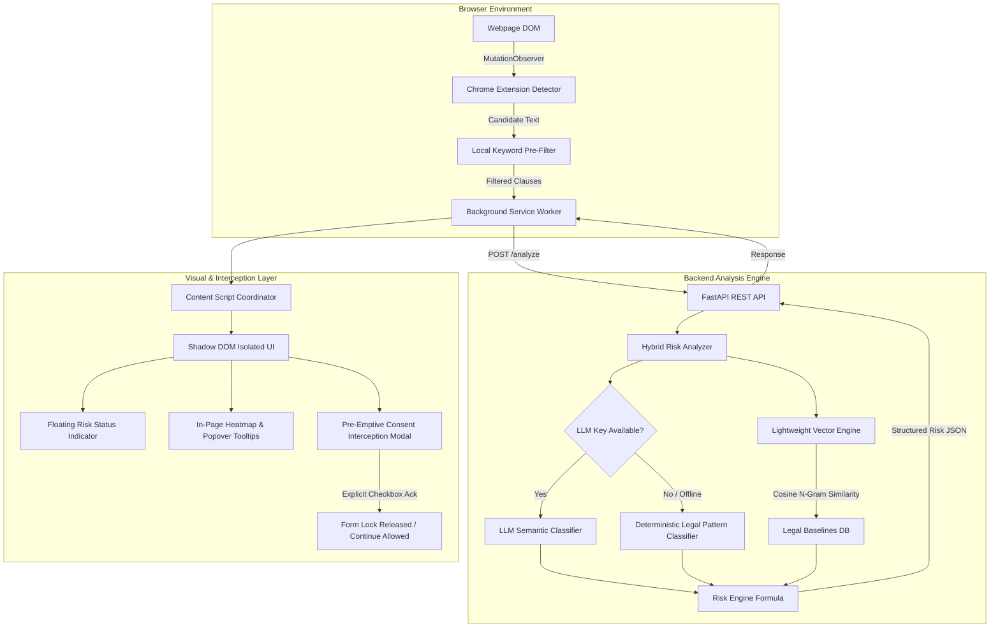

# WebSense Technical Architecture Document

## System Overview

WebSense is an autonomous browser safety system that operates directly at the moment of legal consent. It continuously monitors the browser DOM for legal agreements (Terms of Service, Privacy Policies, NDAs, SaaS Contracts), performs fast local extraction, computes risk scores via a deterministic semantic backend, and pre-emptively intercepts submission when high-risk clauses are present.

---

## Component Architecture Diagram



---

## Risk Engine Mathematical Model

$$\text{Document Risk Score} = \text{clamp}\left(\text{Top Clause Score} + \sum_{i=1}^{n} (\text{Clause}_i \times 0.45 \times 0.55^{0.7i}) + \text{Breadth Bonus}, 0, 100\right)$$

Where each individual clause score is computed as:

$$\text{Clause Score} = (\text{Severity Weight} \times \text{Confidence}) + \left(\frac{\text{Deviation Score}}{100} \times 15\right) - \text{Mitigation Discount}$$

### Risk Level Ranges
- **0 – 29**: `LOW RISK` (Calm Green)
- **30 – 59**: `MODERATE RISK` (Warning Amber)
- **60 – 79**: `HIGH RISK` (Orange/Red)
- **80 – 100**: `CRITICAL RISK` (Urgent Red)

---

## Data Privacy Architecture

```
User Web Browsing
   │
   ▼
Local DOM Extraction (Extension)
   │
   ▼
Local Regex Pre-Filtering (Only agreement snippets extracted)
   │
   ▼
FastAPI Backend (No raw page logging / Stateless)
   │
   ▼
Structured Risk Signals Returned to Browser
```

WebSense enforces local-first filtering. It **never** sends full raw web page HTML or un-related DOM content to external services.
